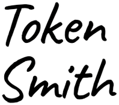
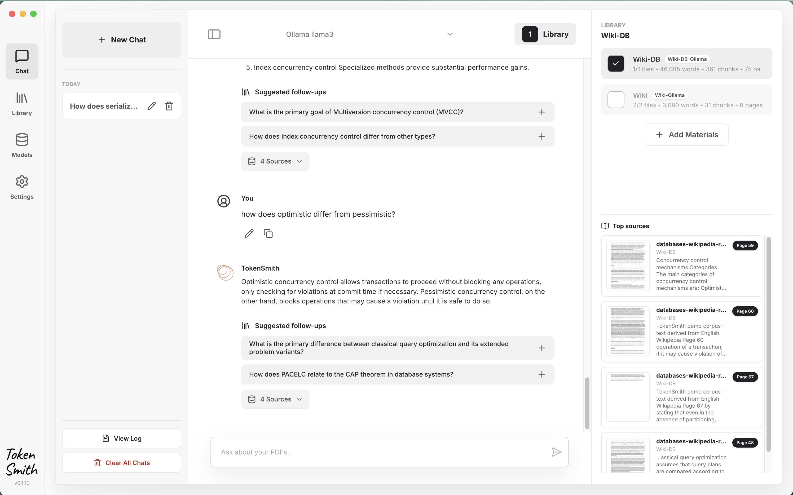

<p align="center">
  
  &nbsp;&nbsp;&nbsp;&nbsp;&nbsp;&nbsp;
  
</p>

TokenSmith is a desktop app for students to ask questions on your course documents (PDFs). 

It runs locally on your machine, retrieves passages relevant to your question from your documents, and shows the **page sources** with each answer.

<p align="center">
  
</p>

## Student Workflow

1. Install and start Ollama.
2. Download the recommended local embedder and chat models.
3. Add a folder containing your course PDFs.
4. Ask questions in Chat or pick a suggested question.
5. Use page source cards to explore where an answer came from within the document and **skim through the page**.
6. Continue with your own questions or suggested follow-up questions to study deeper.

## What TokenSmith Does

- Indexes PDFs for local search using the embedder model.
- Retrieves relevant passages before answering using a vector index.
- Answers with page source cards for cross-checking with the documents.
- Suggests follow-up questions.

## Install

Download the latest app from the GitHub Releases page: https://github.com/georgia-tech-db/TokenSmith/releases

On first launch, TokenSmith will guide you through installing Ollama, downloading models, and adding PDFs.

## Developer Setup

Install dependencies:

```sh
npm install
```

Build the local Python runtime used by development and packaging:

```sh
npm run setup:python-runtime
```

Start the app locally:

```sh
npm run dev
```

Run tests:

```sh
npm run typecheck
npm test
```

## Packaging

Create a macOS DMG:

```sh
npm run package:mac
```

Create a Windows portable zip:

```sh
npm run package:win
```
