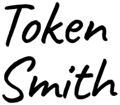

<p align="center">
  
  &nbsp;&nbsp;&nbsp;&nbsp;&nbsp;&nbsp;
  
</p>

# TokenSmith

TokenSmith is a desktop app for students to ask questions on your course documents (PDFs). 

It runs locally on your machine, retrieves passages relevant to your question from your documents, and shows the **page sources** with each answer.

<p align="center">

</p>

## Student Workflow

1. Install and start Ollama.
2. Download the recommended local embedder and chat models.
3. Add a folder containing your course PDFs.
4. Ask questions in Chat or pick a suggested question.
5. Use page source cards to explore where an answer came from within the document and **skim through the page**.
6. Continue with your own questions or suggested follow-up questions to study deeper.

## What TokenSmith Does

- Indexes PDFs for local search using the embedder model.
- Retrieves relevant passages before answering using a vector index.
- Answers with page source cards for cross-checking with the documents.
- Suggests follow-up questions.

## Install

Download the latest app from the GitHub Releases page: https://github.com/georgia-tech-db/TokenSmith/releases

On first launch, TokenSmith will guide you through installing Ollama, downloading models, and adding PDFs.

## Developer Setup

Install dependencies:

```sh
npm install
```

Download the pinned, platform-specific Python runtime and install TokenSmith's
Python dependencies inside it:

```sh
npm run setup:python-runtime
```

This creates `app_runtime/python` inside the repository. It does not require,
modify, or install packages into your system Python. The download is selected
for Linux x64, Windows x64, or macOS ARM64 and verified with SHA-256 before it
is used.

The runtime comes from Astral's
[python-build-standalone](https://github.com/astral-sh/python-build-standalone)
`install_only_stripped` archives. TokenSmith pins the Python version, release,
target platform, and checksum rather than copying the developer's Python
installation.

Start the app locally:

```sh
npm run dev
```

Run tests:

```sh
npm run typecheck
npm test
```

## Packaging

Packaging requires `npm run setup:python-runtime` first. Release workflows run
that command automatically and include the private runtime in each application,
so students do not need to install Python.

Create a macOS DMG:

```sh
npm run package:mac
```

Create a Windows portable zip:

```sh
npm run package:win
```
